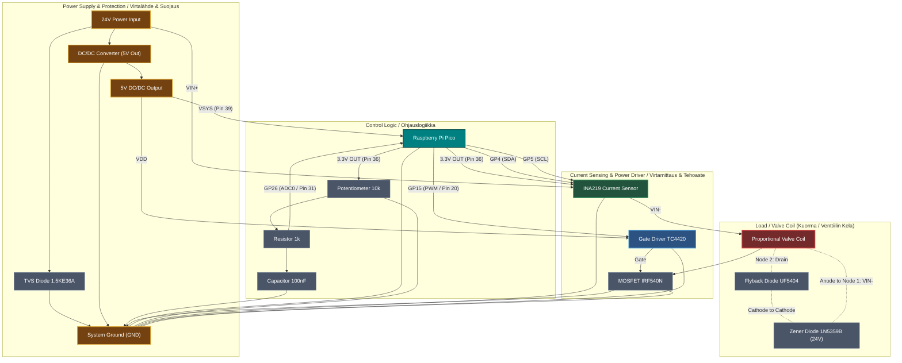

# Proportional Valve Controller / Proportionaaliventtiilin Ohjain (RP2040)

This document contains instructions in both Finnish and English.
Tämä dokumentti sisältää ohjeet sekä suomeksi että englanniksi.

---

## 🇫🇮 Suomenkielinen dokumentaatio

### 1. Yleiskatsaus
Tämä projekti kuvaa edullisen, suljetun säätöpiirin (closed-loop) proportionaaliventtiiliohjaimen, joka on rakennettu Raspberry Pi Pico (RP2040) -mikrokontrollerin ympärille. Ohjain on suunniteltu erityisesti 24 V raskaan kaluston järjestelmiin (esim. Kawasakin SKC5P-14A -pumppuventtiilit).

**Pääominaisuudet:**
- **Virtatakaisinkytkentä (Closed-Loop):** Pitää venttiilin virran ja karan asennon vakaana kelan lämpötilavaihteluista huolimatta (PI-säätö INA219-sensorilla).
- **Laitteistotason Dither (muokattava):** Picon erittäin tarkan PWM-generaattorin avulla tuotettu matalataajuinen dither-signaali, joka estää venttiilin karan takertelun (stiction).
- **Tehokas laskentakyky:** RP2040:n dual-core ARM Cortex-M0+ -arkkitehtuuri tarjoaa riittävästi tehoa reaaliaikaiseen PI-säätöön, ditherin laskentaan ja sarjaporttivianmääritykseen (debugging).
- **Häiriösuojaus:** Suunniteltu sietämään työkoneiden jännitepiikkejä (Load dump) TVS- ja Zener-suojadiodeilla.

### 2. Komponenttilistaus (BOM)

| Komponentti | Malli / Tyyppi | Käyttötarkoitus | Huomautus |
| :--- | :--- | :--- | :--- |
| **Mikrokontrolleri** | Raspberry Pi Pico (RP2040) | Äly, PWM ja PI-säätö. Sisältää USB-ohjelmoinnin ja sarjaporttidebuggauksen. | Voi käyttää myös Pico W -mallia. |
| **Virtamittaus** | INA219 (I2C-moduuli) | Mittaa kelan läpi kulkevan virran reaaliajassa. | Käyttöjännite 3.3V Picon linjasta. |
| **DC/DC-muunnin** | Traco TSR 1-2450 tai Recom R-785.0 | Laskee työkoneen 24V jännitteen häviöttömästi 5 volttiin (Picon VSYS-pinnille). | Minimissään 500mA versio. |
| **Gate Driver** | TC4420 (tai MIC4427 / TC4427) | Sovittaa Picon 3.3V GPIO-signaalin MOSFETin ohjaushilalle (Gate) riittävällä jännitteellä ja virralla. | Erittäin tärkeä MOSFETin nopealle toiminnalle. |
| **MOSFET** | IRF540N tai IRL540 | Kytkee 24V jännitettä venttiilin kelalle. | IRL540 on logic-level-malli ja aukeaa matalammalla jännitteellä. |
| **Vapaakytkintädiodi** | UF5404 tai UF5408 | Nopea diodi magneettikentän purkamiseen (Fast Flyback). | UF5408 kestää korkeampaa jännitettä (1000V). |
| **Zener-diodi** | 1N5359B (24V, 5W) | Vauhdittaa kelan purkautumista yhdessä vapaakytkintädiodin kanssa. | Nopeuttaa karan palautumista. |
| **TVS-diodi** | 1.5KE36A tai 1.5KE36CA | Tappaa 24V järjestelmän yli 36V jännitepiikit. | Suojaa koko kytkentää työkoneen kuormaiskuilta. |
| **Potentiometri** | 10 kΩ (Lineaarinen) | Käyttöliittymä tavoitevirran asettamiseen (150–700 mA). | Kytketään 3.3 V jännitteeseen. |

### 3. Raspberry Pi Pico Kytkennät (Pinout)

- **VSYS (Pin 39):** Virtalähteen 5V sisääntulo (Traco/Recom DC/DC-muuntimelta).
- **GND (Pin 38 tai mikä tahansa GND):** Yhteinen maapiste (Työkoneen runko / akun miinus).
- **3.3V OUT (Pin 36):** Syöttää 3.3 V jännitteen INA219-moduulille sekä 10 kΩ potentiometrin yläpäähän.
- **GP4 / SDA (Pin 6):** INA219-moduulin SDA-pinni.
- **GP5 / SCL (Pin 7):** INA219-moduulin SCL-pinni.
- **GP26 / ADC0 (Pin 31):** Kytketään potentiometrin liukuun (suositellaan 1 kΩ sarjavastusta ja 100 nF kondensaattoria maihin RC-suotimeksi).
- **GP15 / PWM Out (Pin 20):** Kytketään TC4420 Gate Driverin IN-pinniin.

### 4. Kytkentäkaavio (Wiring Diagram)



### 5. Ohjelmointi (PlatformIO)
Projekti on määritelty PlatformIO-projektiksi (juuresta löytyy `platformio.ini`), mikä on suositeltava kehitysympäristö. Pico on helppo ohjelmoida USB-liitännän kautta ilman ulkoisia ohjelmointilaitteita.

1. Avaa projektikansio VS Codessa, jossa on PlatformIO-laajennus.
2. PlatformIO käyttää `platformio.ini`-tiedostoa, johon on asetettu seuraavat asetukset Picolle (tämä lataa tarvittavat kirjastot automaattisesti):

```ini
[env:pico]
platform = raspberrypi
board = pico
framework = arduino
lib_deps = adafruit/Adafruit INA219 @ ^1.2.1
```

**Latausohje:**
1. Kytke micro-USB-kaapeli tietokoneeseen.
2. Jos koodia ladataan ensimmäistä kertaa, pidä Picon **BOOTSEL**-painiketta painettuna samalla kun kytket USB-johdon. Pico ilmestyy tietokoneelle massamuistilaitteena (RPI-RP2).
3. Paina PlatformIO:sta **Upload** (nuoli-kuvake). Kääntäjä luo `.uf2`-tiedoston ja siirtää sen automaattisesti Picolle, minkä jälkeen laite käynnistyy uudelleen ja ajaa koodia.
4. Jatkossa voit käyttää tavallista sarjaportti-uploadia suoraan PlatformIO:sta ilman BOOTSEL-painikkeen painamista.

*(Vaihtoehtoisesti koodin voi myös kääntää perinteisessä Arduino IDE -ympäristössä kopioimalla `src/main.cpp`:n sisällön uuteen luonnokseen ja asentamalla "Adafruit INA219" -kirjaston sekä "Raspberry Pi Pico" -tuen Board Managerin kautta).*

---

## 🇬🇧 English Documentation

### 1. Overview
This project details a low-cost, closed-loop proportional valve controller built around a Raspberry Pi Pico (RP2040) microcontroller. The controller is specifically designed for 24V heavy machinery systems (e.g., Kawasaki SKC5P-14A pump valves).

**Key Features:**
- **Closed-Loop Current Control:** Maintains stable coil current and spool position regardless of coil temperature variations via a PI controller reading from an INA219 current sensor.
- **Hardware Dither (Configurable):** Utilizes the RP2040's highly flexible PWM block to generate low-frequency dither PWM, preventing spool stiction.
- **High Computational Power:** The dual-core ARM Cortex-M0+ architecture provides plenty of processing overhead for real-time PI loops, dither math, and detailed serial debugging logs.
- **Transient Protection:** Designed with TVS and Zener diodes to withstand harsh 24V load dumps commonly found in heavy machinery.

### 2. Bill of Materials (BOM)

| Component | Model / Type | Purpose | Notes |
| :--- | :--- | :--- | :--- |
| **Microcontroller** | Raspberry Pi Pico (RP2040) | Core logic, PWM, and PI control. Handles USB bootloader and serial logging. | Pico W (Wi-Fi/BT) can also be used. |
| **Current Sensor** | INA219 (I2C Module) | Reads the actual current passing through the valve coil in real time. | Powered by the Pico's 3.3V rail. |
| **DC/DC Converter** | Traco TSR 1-2450 or Recom R-785.0 | Steps down the 24V system voltage to a clean 5V logic supply (Pico VSYS pin). | Minimum 500mA version. |
| **Gate Driver** | TC4420 (or MIC4427 / TC4427) | Rapidly drives the MOSFET gate using 3.3V signals stepped up to VDD (5V/12V). | Critical for fast switching. |
| **MOSFET** | IRF540N or IRL540 | Switches the 24V load across the valve coil. | IRL540 is logic-level and opens at lower voltages. |
| **Flyback Diode** | UF5404 or UF5408 | Ultra-fast rectifier for magnetic field collapse (Fast Flyback). | UF5408 features a higher voltage rating (1000V). |
| **Zener Diode** | 1N5359B (24V, 5W) | Accelerates coil discharge when placed in series with the UF5404/UF5408. | Speeds up spool spring return. |
| **TVS Diode** | 1.5KE36A or 1.5KE36CA | Suppresses voltage spikes exceeding 36V in the 24V line. | Protects the circuit from load dumps. |
| **Potentiometer** | 10 kΩ (Linear) | User interface to set target current (150–700 mA). | Connected to the 3.3V rail. |

### 3. Raspberry Pi Pico Pin Configuration

- **VSYS (Pin 39):** 5V logic supply input (from Traco/Recom DC/DC converter).
- **GND (Pin 38 or any GND):** Common ground (Chassis / Battery negative).
- **3.3V OUT (Pin 36):** Supplies 3.3V power to the INA219 module and the high end of the 10 kΩ potentiometer.
- **GP4 / SDA (Pin 6):** Connected to INA219 SDA pin.
- **GP5 / SCL (Pin 7):** Connected to INA219 SCL pin.
- **GP26 / ADC0 (Pin 31):** Connected to the 10 kΩ potentiometer wiper (a 1 kΩ series resistor and 100 nF capacitor to GND is recommended as an RC filter).
- **GP15 / PWM Out (Pin 20):** Connected to the TC4420 Gate Driver IN pin.

### 4. Wiring Diagram (Kytkentäkaavio)
*(Refer to the Mermaid diagram in the Finnish section above for the full visual schematic).*

### 5. Programming (PlatformIO)
This project is configured as a PlatformIO project (featuring a `platformio.ini` in the root), which is the recommended development environment. The Pico is flashed directly via USB without external programmers.

1. Open the project folder in VS Code with the PlatformIO extension installed.
2. PlatformIO utilizes the `platformio.ini` configuration, which is set up for the Pico as follows (this will download library dependencies automatically):

```ini
[env:pico]
platform = raspberrypi
board = pico
framework = arduino
lib_deps = adafruit/Adafruit INA219 @ ^1.2.1
```

**Flashing Instructions:**
1. Connect a micro-USB cable to your PC.
2. If uploading for the first time, hold down the **BOOTSEL** button on the Pico while plugging in the USB cable. The Pico will mount as a USB storage drive (RPI-RP2).
3. Click **Upload** (arrow icon) in PlatformIO. The toolchain compiles the code to a `.uf2` file and writes it to the Pico. The board resets and starts executing the code immediately.
4. For subsequent uploads, you can use the standard USB serial upload from PlatformIO without holding down the BOOTSEL button.

*(Alternatively, the code can be built in the traditional Arduino IDE by copying the contents of `src/main.cpp` into a new sketch, and installing the "Adafruit INA219" library and "Raspberry Pi Pico" board support via the Board Manager).*
